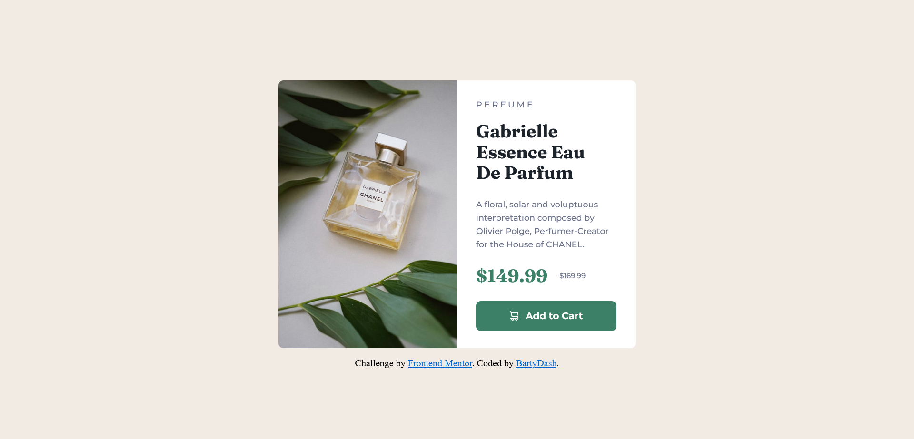

# Frontend Mentor - Product preview card component solution

This is a solution to the [Product preview card component challenge on Frontend Mentor](https://www.frontendmentor.io/challenges/product-preview-card-component-GO7UmttRfa). Frontend Mentor challenges help you improve your coding skills by building realistic projects. 

## Table of contents

- [Overview](#overview)
  - [Screenshot](#screenshot)
  - [Links](#links)
- [My process](#my-process)
  - [Built with](#built-with)
  - [What I learned](#what-i-learned)
  - [Continued development](#continued-development)
- [Author](#author)

## Overview

### Screenshot

### Links

- Solution URL: [solution](https://github.com/BartyDash/product-preview-card-component)
- Live Site URL: [website](https://your-live-site-url.com)

## My process

### Built with

- Semantic HTML5 markup
- CSS custom properties
- Flexbox

### What I learned

I had my first meeting with the button. I learned his interesting properties. This project gave me a lot of experience with CSS styles.

### Continued development

I want to learn how to make mobile first website and grid display.

## Author

- Website - [BartyDash](https://github.com/BartyDash)
- Frontend Mentor - [@BartyDash](https://www.frontendmentor.io/profile/BartyDash)